# UC-Berkeley-ML-AI---Capstone_Work_Sample
# Comprehensive EDA Insight Report

## Executive Summary
#### Project Goals and Objectives

The COVID-19 pandemic exposed significant challenges in hospital resource management, prompting our project to focus on identifying key factors affecting the duration of hospital stays. Our primary aim was to improve patient care, optimize resource allocation, and develop targeted strategies to reduce unnecessary extended hospitalizations. To achieve these objectives, we employed sophisticated machine learning and deep learning techniques, enabling us to:

1. **Enhance Patient Care:** Understand the social, financial, and demographic factors that impact patient recovery times, enabling the development of personalized care plans.
2. **Optimize Hospital Resources:** Identify operational bottlenecks and resource allocation inefficiencies to streamline patient management and reduce overall hospital stay durations.
3. **Develop Targeted Interventions:** Utilize data-driven insights to create and implement strategies that address specific factors contributing to prolonged hospital stays.

## Key Insights

### Numerical Distribution
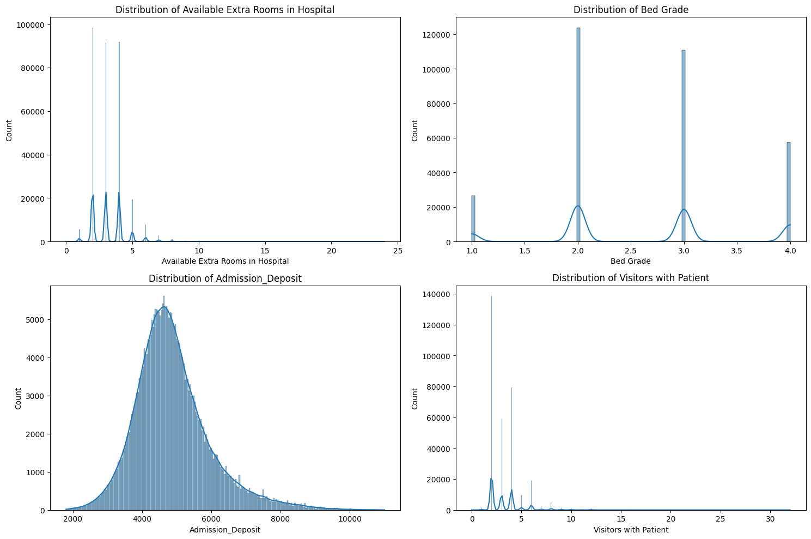
1. Available Extra Rooms in Hospital:

   - Most hospitals have 2-5 extra rooms available
   - Peaks at 2, 3, and 4 extra rooms
   - Very few hospitals have more than 10 extra rooms

2. Bed Grade:

   - Distinct grades at 1, 2, 3, and 4
   - Grade 2 is most common, followed by grade 3
   - Grades 1 and 4 are less frequent

3. Admission Deposit:

   - Normal distribution centered around 4000-5000
   - Range mostly between 2000 and 8000
   - Few outliers above 8000

4. Visitors with Patient:

   - Highly skewed distribution
   - Most patients have 0-5 visitors
   - Sharp decline after 5 visitors
   - Very few cases with more than 10 visitors
  
### Group-wise Statistics for Numerical Features
| Stay                 | Available Extra Rooms in Hospital | Bed Grade | Admission Deposit | Visitors with Patient |
|----------------------|-----------------------------------|-----------|-------------------|-----------------------|
| 0-10                 | 3.268599                          | 2.583545  | 4615.214625       | 2.565158              |
| 11-20                | 3.262814                          | 2.731786  | 4931.124829       | 2.738940              |
| 21-30                | 3.359008                          | 2.496097  | 5025.310329       | 2.679487              |
| 31-40                | 3.136242                          | 2.662974  | 4871.071067       | 3.453797              |
| 41-50                | 3.334412                          | 2.539215  | 4888.818530       | 3.032785              |
| 51-60                | 2.911731                          | 2.611000  | 4748.784397       | 4.390828              |
| 61-70                | 3.179300                          | 2.559402  | 4845.449344       | 3.566691              |
| 71-80                | 2.872733                          | 2.654671  | 4709.845426       | 4.892335              |
| 81-90                | 2.844977                          | 2.841670  | 4590.644688       | 6.100661              |
| 91-100               | 2.854611                          | 2.661844  | 4715.538879       | 5.315732              |
| More than 100 Days   | 2.739638                          | 2.907527  | 4649.341763       | 7.891516              |

- **Available Extra Rooms in Hospital**:
  - Patients with shorter stays (0-10 days) have a higher average of extra rooms available compared to those with longer stays (more than 100 days).

- **Bed Grade**:
  - Patients with stays of 81-90 days and 'More than 100 Days' tend to have higher average bed grades.

- **Admission_Deposit**:
  - Admission deposits generally increase with the length of stay, peaking around 21-30 days.

- **Visitors with Patient**:
  - The number of visitors increases significantly with the length of stay. Patients with 'More than 100 Days' have the highest average number of visitors.

### Categorical Distribution

1. Hospital Distribution:

   - There's significant variation in the number of cases across different hospitals, with some (e.g., codes 8, 28) handling notably higher volumes.
   - This suggests differences in hospital capacity, specialization, or regional patient density.

2. Hospital Types:

   - Type 'e' hospitals are most prevalent, followed by type 'b'.
   - Types 'g' and 'a' are least common, indicating possible specialization or regional distribution patterns.

3. City Distribution:

   - Cities 1, 2, and 6 have the highest number of hospital cases.
   - This could reflect population density or the presence of major medical centers in these areas.

4. Hospital Regions:

   - Region X has the highest number of cases, followed by Y and Z.
   - This suggests regional differences in healthcare infrastructure or population health needs.

5. Departments:

   - Gynecology department has significantly more cases than others shown.
   - This could indicate a focus on women's health services or higher demand in this area.

6. Ward Types:

   - R and Q wards are most common, while P, T, and U are rare.
   - This may reflect the general layout and specialization of hospitals in the dataset.

7. Ward Facilities:

   - Facility F is most prevalent, followed by E and D.
   - This could indicate standardization in hospital designs or common facility categorizations.

8. Admission Types:

   - Trauma admissions are slightly more common than Emergency, with Urgent being least frequent.
   - This distribution provides insight into the types of cases hospitals are handling most often.

9. Severity of Illness:

   - Moderate cases are most common, followed by Minor. Extreme cases are least frequent.
   - This gives an overview of the general patient condition spectrum hospitals are dealing with.

10. Age Distribution:

    - Patients aged 31-60 form the largest groups.
    - Very young (0-10) and very old (91-100) patients are least common.
    - This reflects the demographic of patients requiring hospital care, with middle-aged adults being the primary users.

#### 1. **Regional and Admission Insights**
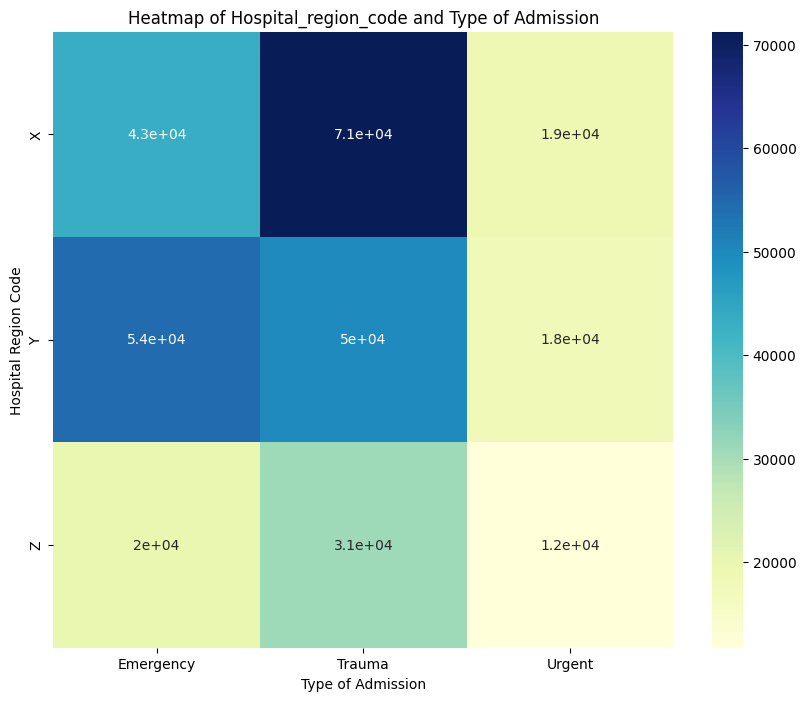
   - **Observation**: Region X has the highest trauma admissions, Region Y balances emergency and trauma cases, and Region Z has the least trauma cases.
   - **Interpretation**: Region X might have higher accident rates or superior trauma facilities. Region Y’s balanced intake indicates varied demographics or multiple specialties, while Region Z could have fewer incidents or limited trauma care.

#### 2. **Department and Severity of Illness Insights**

   - **Observation**: Gynecology has many moderate severity patients, anesthesia and radiotherapy handle many minor cases, and surgery has fewer patients overall.
   - **Interpretation**: Gynecology manages complex but non-critical cases, anesthesia and radiotherapy handle routine procedures, and surgery deals with specialized or critical operations.

#### 3. **Ward Type and Severity of Illness Insights**
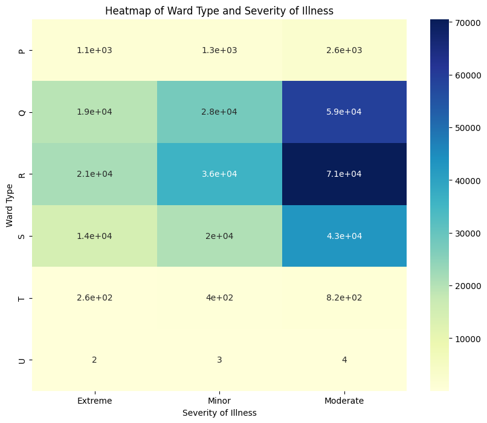
   - **Observation**: Wards Q and R manage the most moderate severity patients, Ward S handles a mix of minor and moderate cases, and Wards T and U have very few patients.
   - **Interpretation**: Wards Q and R focus on complex but stable conditions, Ward S is versatile for various needs, and Wards T and U might be specialized or overflow units.

#### 4. **Hospital Type and Department Insights**
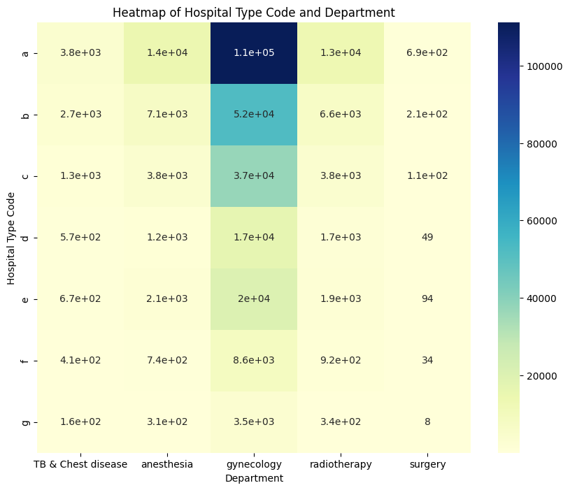
   - **Observation**: Hospital type 'a' has many gynecology patients, type 'b' manages significant numbers in gynecology and anesthesia, while others handle fewer patients overall.
   - **Interpretation**: Hospital type 'a' focuses on gynecology, type 'b' has diverse capabilities, and other types might be smaller or specialized facilities.

#### 5. **Ward Facility and Age Insights**
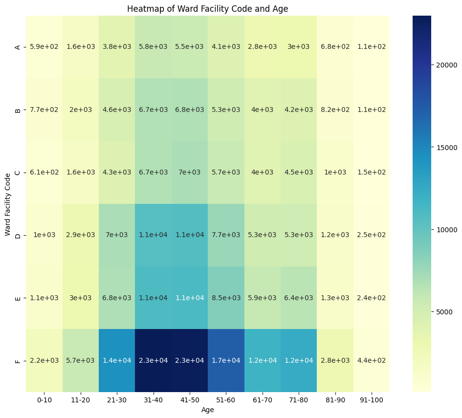
   - **Observation**: Ward facility F handles many patients aged 21-50, while others have evenly distributed ages.
   - **Interpretation**: Ward F caters to working-age adults, possibly due to specialized treatments, while others provide general or multi-specialty care.

#### 6. **Hospital Code and Department Insights**
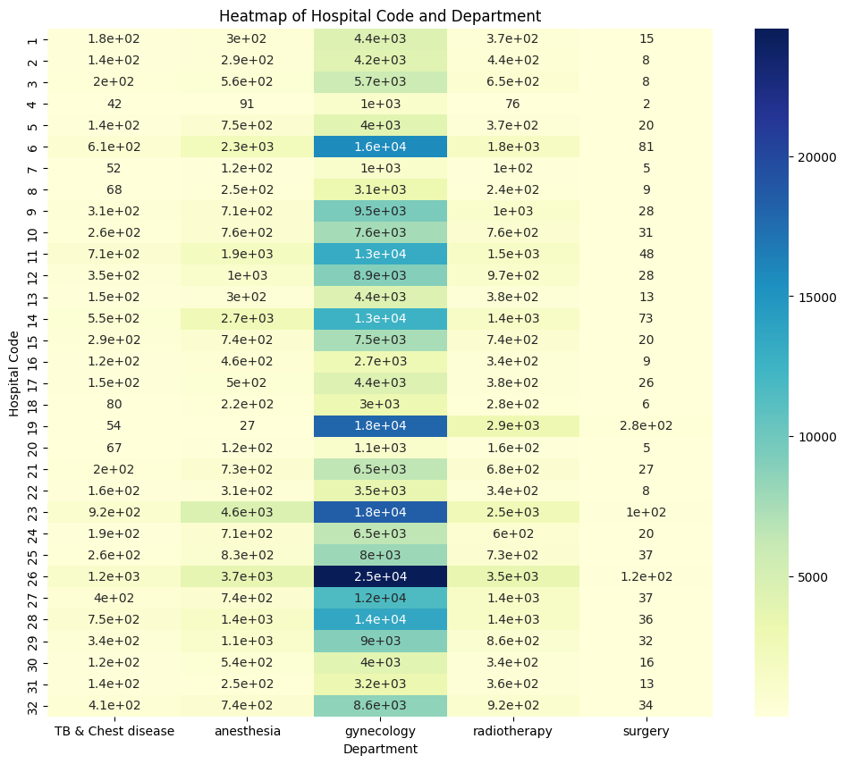
   - **Observation**: Hospitals 13 and 25 have many gynecology patients, while others show varied distributions.
   - **Interpretation**: Hospitals 13 and 25 likely specialize in gynecology, while others offer balanced services across departments.

#### 7. **Hospital Region and Severity of Illness Insights**
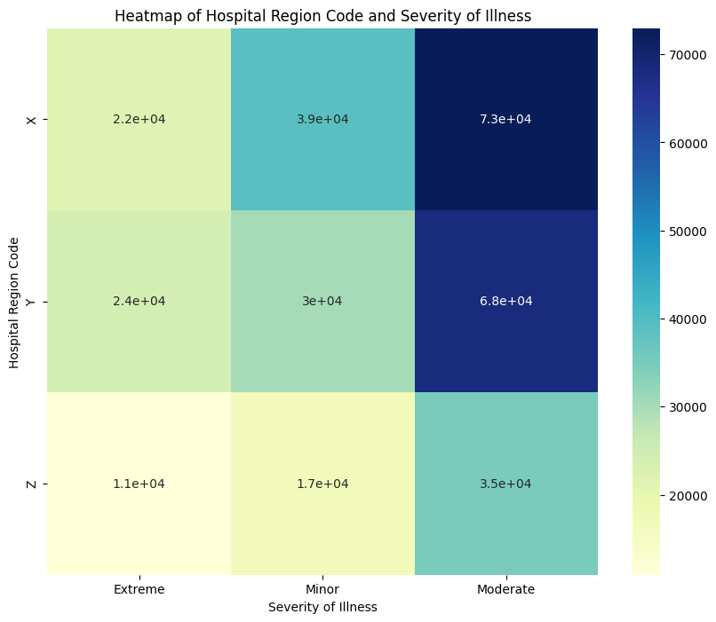
   - **Observation**: Regions X and Y handle many moderate severity cases, Region Z has fewer patients across all severities.
   - **Interpretation**: Regions X and Y might have better facilities or more hospitals, while Region Z handles fewer patients due to fewer facilities or lower population density.

#### 8. **Type of Admission and Ward Type Insights**

   - **Observation**: Trauma and emergency admissions are highest in wards Q and R, while urgent cases are evenly distributed.
   - **Interpretation**: Wards Q and R specialize in severe cases, indicating specialized resources and staff, while urgent cases are managed flexibly.

#### 9. **Type of Admission and Department Insights**
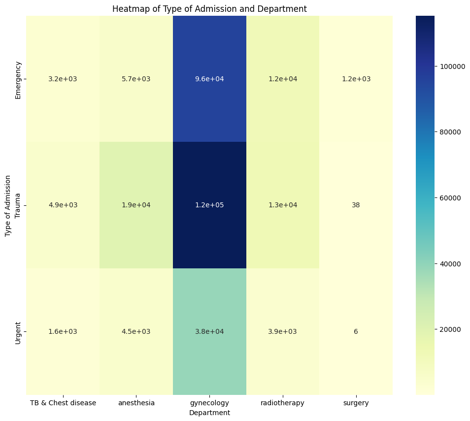
   - **Observation**: Trauma admissions are highest in gynecology, emergency admissions are also high in gynecology and anesthesia.
   - **Interpretation**: Gynecology handles significant trauma cases, indicating a role in urgent and complex care, while anesthesia manages many emergency cases due to urgent surgeries.

#### 10. **Severity of Illness and Hospital Type Insights**
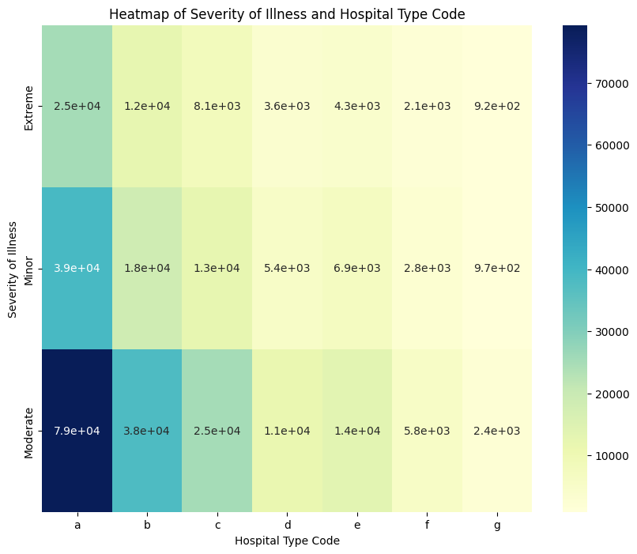
   - **Observation**: Hospital type 'a' manages many moderate severity cases, types 'b' and 'c' handle significant numbers with balanced severity.
   - **Interpretation**: Hospital type 'a' focuses on moderate severity cases, while types 'b' and 'c' offer versatile healthcare across severity levels.
#### 11. **Ward Type and Department Insights**
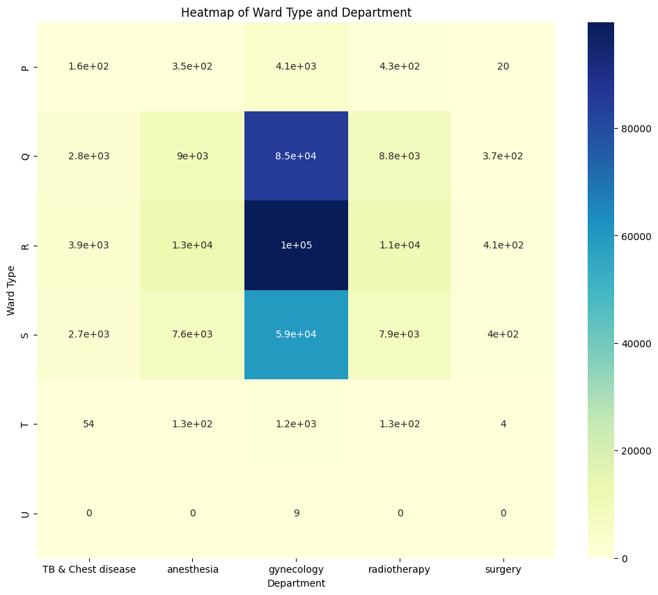
- **Observation**: 
  - **Ward R**: Highest patients in gynecology (100,000+), followed by anesthesia (13,000+) and radiotherapy (11,000+).
  - **Ward Q**: Significant patients in gynecology (85,000+) and anesthesia (9,000+).
  - **Ward S**: Balanced distribution in gynecology (59,000+), radiotherapy (7,900+), and anesthesia (7,600+).
  - **Wards P, T, U**: Few patients across all departments, suggesting specialization or underutilization.

- **Interpretation**: 
  - **Wards R and Q**: Focus on gynecology and anesthesia.
  - **Ward S**: Versatile, handling diverse medical needs.
  - **Wards P, T, U**: Potentially specialized or less critical roles in patient management.

### Recommendations
- **Resource Allocation**: Focus on high-demand wards (R, Q) and evaluate underutilized wards (P, T, U) for potential repurposing.
- **Specialized Care**: Enhance trauma and emergency care in high-demand regions (X, Y).
- **Department Focus**: Prioritize resources in gynecology and anesthesia, particularly in hospitals with high patient volumes.
- **Age-Specific Care**: Develop specialized programs for working-age adults in ward facility F.

### Cluster Anlysis

#### Facility Quality Analysis:

| Cluster | Bed Grade | Admission Deposit | Available Extra Rooms in Hospital | Visitors with Patient |
|---------|-----------|-------------------|-----------------------------------|-----------------------|
| 0       | 2.718777  | 4822.332569       | 3.191379                          | 3.207386              |
| 1       | 2.643691  | 4915.111255       | 3.326893                          | 3.353973              |
| 2       | 2.418740  | 4814.594104       | 3.076863                          | 3.309846              |
| 3       | 2.683682  | 4924.294393       | 3.213104                          | 3.275624              |

1. Cluster 0 (Balanced): Moderate bed grades, admission deposits, and extra rooms. Average visitor numbers. Represents well-balanced hospitals with efficient resource utilization.

2. Cluster 1 (High-End): Second-highest bed grades, highest admission deposits and extra rooms. Most visitors. Indicates premium hospitals with better facilities and higher costs.

3. Cluster 2 (Budget): Lowest bed grades, deposits, and extra rooms. Second-highest visitors. Suggests older or less-equipped facilities with high occupancy rates, possibly serving lower-income areas.

4. Cluster 3 (Mixed): Highest bed grades, second-highest deposits. Average extra rooms and visitors. Represents a mix of high-quality facilities with moderate capacity and costs.

Key insights:

- Clear differentiation in facility quality and pricing across clusters

- Visitor numbers don't vary significantly, suggesting similar patient support across hospital types

- Resource availability (extra rooms) correlates with admission deposits

- Opportunities exist for improving facilities in Cluster 2 and optimizing costs in Cluster 1

- Cluster 0 could serve as a benchmark for balanced operations

#### Cluster Demographics and Patient Outcomes Analysis

1. Hospital Code Distribution:
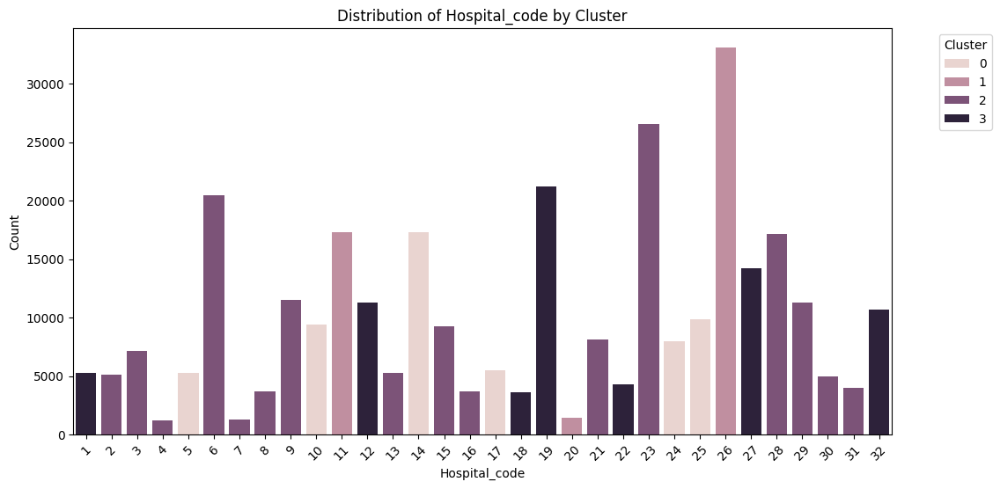

   - Cluster 2 has the highest representation across most hospital codes.
   - Clusters 0 and 1 show more specialized distribution, dominating certain 

2. Hospital Type Code:
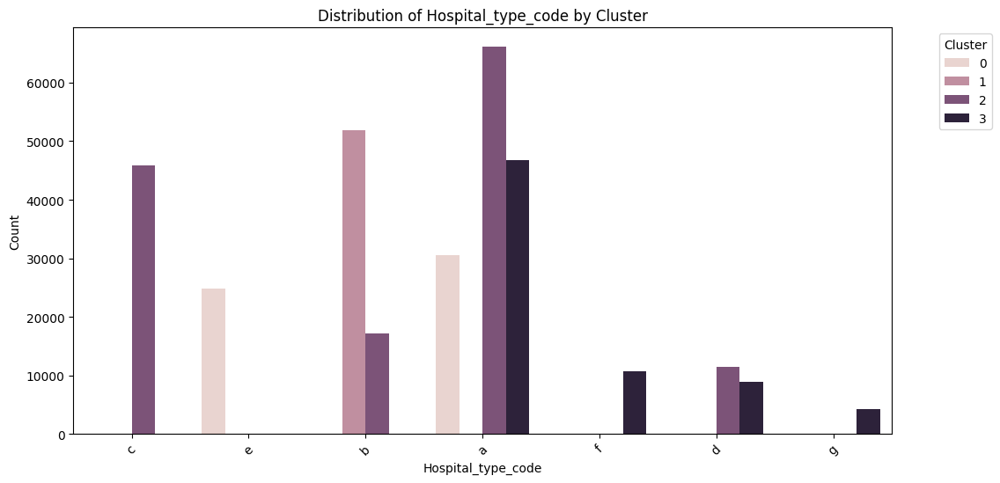

   - Type 'a' hospitals are primarily in Cluster 2, followed by Cluster 3.
   - Type 'b' is dominated by Cluster 1.
   - Type 'c' is exclusively in Cluster 2.
   - Type 'e' is mainly in Cluster 0.
  
3. City Code Hospital:

   - Cities 1 and 2 have the highest case counts, primarily in Clusters 0 and 1 respectively.
   - Cluster 2 is well-represented across most city codes.
  
4. Hospital Region Code:
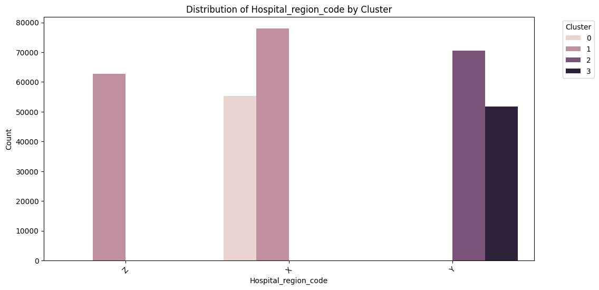

   - Region 'X' is dominated by Cluster 2.
   - Region 'Y' is mainly Cluster 2 and 3.
   - Region 'Z' is split between Clusters 1.

5. Department Distribution:
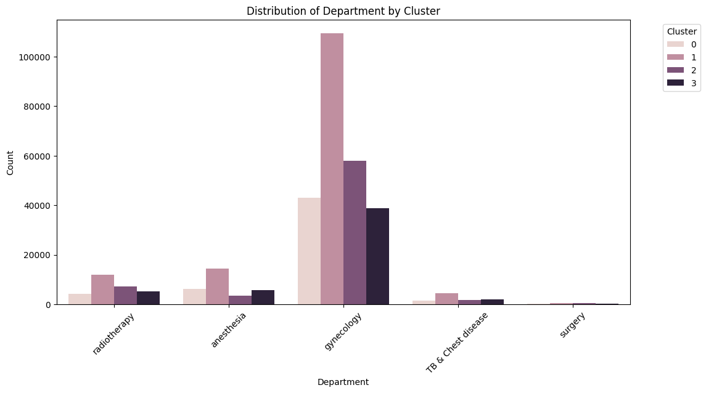

   - Gynecology department has the highest case count across all clusters, with Cluster 1 leading.
   - Radiotherapy and anesthesia show more even distribution across clusters.

6. Ward Type Distribution:
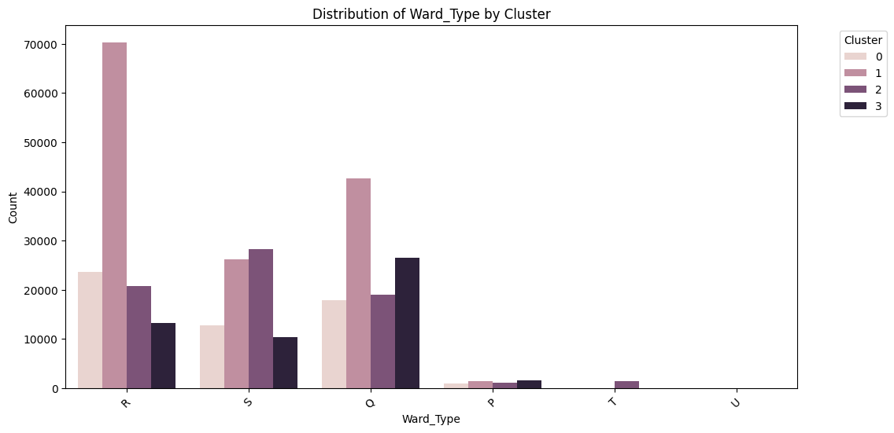

   - Ward type R is dominant in Cluster 2, followed by Cluster 3.
   - Ward type Q is more evenly distributed across clusters, with Cluster 2 leading.
   - Ward type S shows a similar pattern to Q, but with higher representation in Cluster 3.
   - Ward types P, T, and U have minimal representation across all clusters.
  
7. Ward Facility Code:
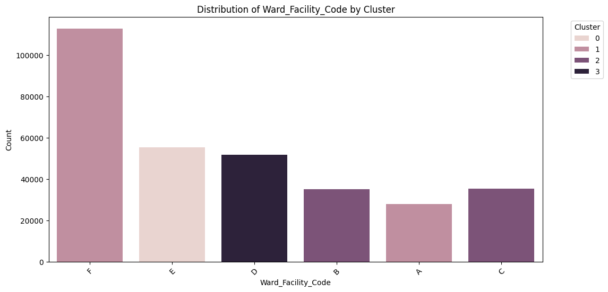

   - Facility F is overwhelmingly represented in Cluster 2.
   - Facilities E and D are more prominent in Clusters 0 and 1 respectively.
   - Facilities B, A, and C show lower overall counts but are mainly represented in Cluster 3.

8. Type of Admission:

   - Trauma admissions are highest in Cluster 1, followed by emergency admissions.
   - Emergency admissions are more evenly distributed across clusters compared to trauma.
   - Urgent admissions have the lowest counts across all clusters.
   - 
9. Severity of Illness:
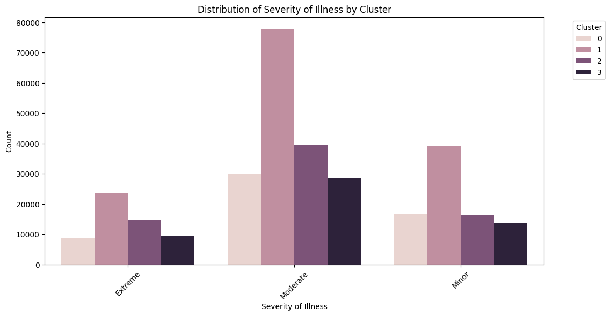

   - Moderate severity dominates across all clusters, with Cluster 1 having the highest count.
   - Minor and extreme severities show similar patterns across clusters, with Cluster 1 leading in both.

10. Age Distribution:
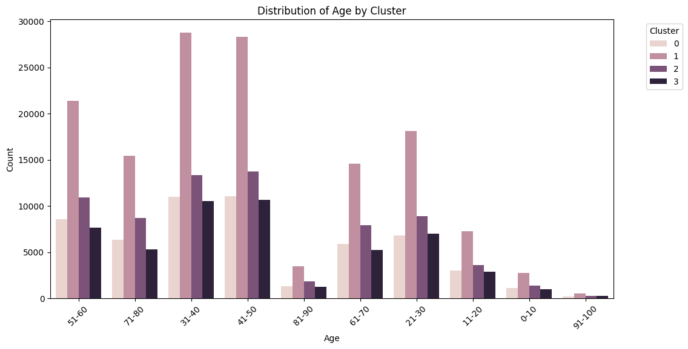

    - Cluster 1 has the highest representation across most age groups.
    - Age groups 31-40 and 41-50 have the highest counts across all clusters.
    - There's a relatively even distribution of ages across clusters, with slight variations.

11. City Code Patient Distribution:
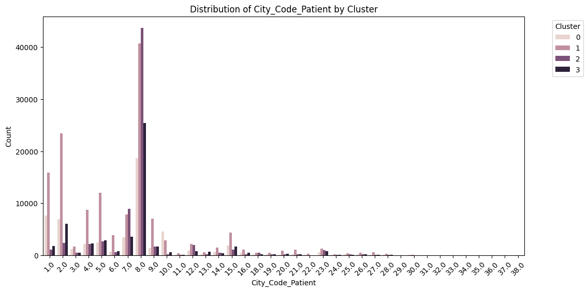

    - City codes 8 and 9 have the highest patient counts across all clusters.
    - Cluster 1 dominates in city codes 1 and 2, while Cluster 2 is predominant in city code 8.
    - City code 9 shows high representation across all clusters, especially in Clusters 1 and 2.
    - Clusters 0 and 3 have significant presence only in specific city codes, suggesting geographical focus.
    - Patient counts vary widely across city codes, indicating differences in population density or hospital usage.
    - City codes above 15 generally have low patient counts across all clusters.

**Summary:**
1. Specialization in Care: Cluster 2 appears to handle a high volume of cases across various ward types, admission types, and severity levels, suggesting it might represent larger, more comprehensive healthcare facilities.

2. Emergency Preparedness: The high number of trauma and emergency admissions, particularly in Cluster 2, indicates a need for robust emergency services in these hospitals.

3. Patient Demographics: The age distribution shows that hospitals across all clusters serve a wide range of age groups, with a slight emphasis on middle-aged patients (31-50 years).

4. Facility Differentiation: The stark differences in ward facility codes across clusters suggest varying levels of infrastructure or specialization among hospital groups.

5. Severity Management: All clusters handle a mix of illness severities, with a predominance of moderate cases. This suggests a need for versatile care capabilities across the hospital system.
### Feature Engineering EDA - Patient Readmissions

#### Total Readmissions by Hospital Type

- **Observation**: Hospital type 'a' has the highest number of readmissions, followed by types 'b' and 'c'.
- **Interpretation**: This suggests that hospital type 'a' might be handling more complex cases or has a larger capacity.

#### Total Readmissions by City Code Hospital
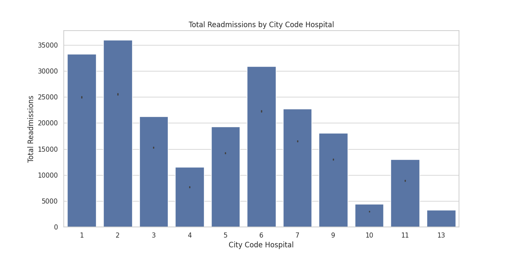
- **Observation**: Cities with hospital codes '1' and '2' have the highest readmissions.
- **Interpretation**: Indicates these hospitals are likely in urban areas with higher patient inflow.

#### Total Readmissions by Hospital Region
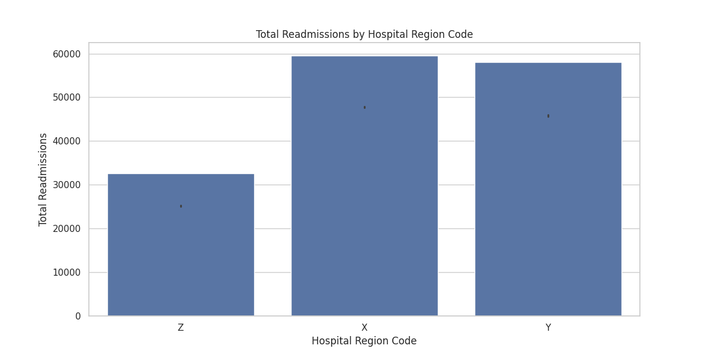
- **Observation**: Regions 'X' and 'Y' have higher readmissions compared to region 'Z'.
- **Interpretation**: Suggests regional differences in hospital capacities or patient demographics.

#### Total Readmissions by Department
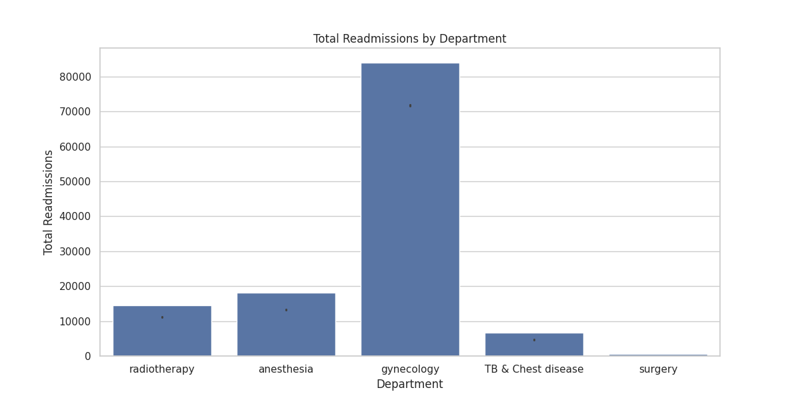
- **Observation**: Gynecology department has the highest readmissions.
- **Interpretation**: This could indicate a higher volume of cases or a need for specialized follow-up care in this department.

#### Total Readmissions by Ward Type

- **Observation**: Ward type 'R' has the highest number of readmissions, followed by ward types 'Q' and 'S'. Ward types 'P', 'T', and 'U' have significantly lower readmissions.
- **Interpretation**: This suggests that ward type 'R' handles a higher volume of patients or more complex cases that lead to higher readmissions. The lower readmissions in ward types 'P', 'T', and 'U' may indicate either lower patient volumes or more effective patient management.

#### Total Readmissions by Ward Facility Code
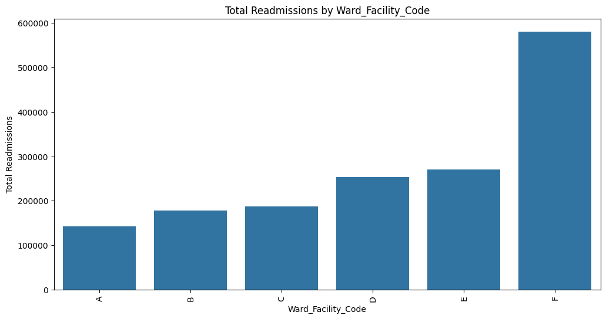
- **Observation**: Ward facility code 'F' has the highest number of readmissions, followed by codes 'E' and 'D'. Codes 'A', 'B', and 'C' have lower readmissions.
- **Interpretation**: This indicates that ward facility 'F' might be serving a larger or more critically ill patient population, resulting in higher readmissions. Facilities 'A', 'B', and 'C' might have better discharge planning or serve less critical cases.

#### Total Readmissions by Type of Admission

- **Observation**: Trauma admissions have the highest number of readmissions, followed by emergency admissions. Urgent admissions have the lowest readmissions.
- **Interpretation**: The higher readmissions for trauma cases reflect the critical and often complex nature of these patients, requiring more frequent readmissions. Emergency cases also show high readmissions due to their acute nature, while urgent cases have comparatively lower readmissions.

#### Total Readmissions by Severity of Illness

- **Observation**: Patients with moderate severity of illness have the highest number of readmissions, followed by those with extreme and minor severity.
- **Interpretation**: This suggests that patients with moderate severity of illness are more likely to be readmitted, possibly due to ongoing health issues that require repeated hospital care. Patients with extreme severity might have higher mortality rates or more intensive care leading to fewer readmissions, while those with minor severity are less likely to be readmitted.

#### Total Readmissions by Age

- **Observation:** Patients in the age groups 31-40 and 41-50 have the highest number of readmissions, followed by those in the 21-30 and 51-60 age groups. The lowest number of readmissions is seen in the youngest (0-10) and oldest (91-100) age groups.
- **Interpretation:** This suggests that middle-aged adults (31-50) are more likely to be readmitted, possibly due to a higher prevalence of chronic conditions or lifestyle-related health issues that necessitate repeated hospital care. Younger children and older adults have lower readmission rates, which could be due to differing health care needs and mortality rates.

### Length of Stay

#### Distribution of Length of Stay
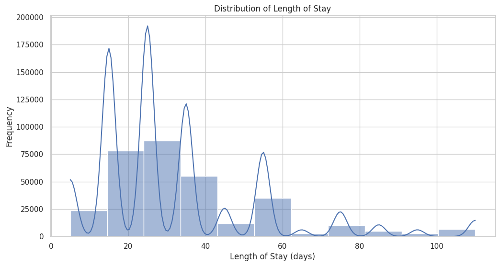
- **Observation**: The distribution of length of stay shows multiple peaks, with the highest frequencies around 10, 20, and 30 days. There are also smaller peaks at intervals beyond 30 days.
- **Interpretation**: This multimodal distribution suggests that hospital stays often follow standardized durations, likely due to clinical protocols or typical recovery periods for certain treatments. The presence of peaks at regular intervals indicates that many patients are discharged after a predefined period, possibly aligned with the hospital's care plans and discharge policies. The smaller peaks at longer durations may reflect the needs of patients with more complex or severe conditions requiring extended care.

#### Length of Stay by Hospital Type
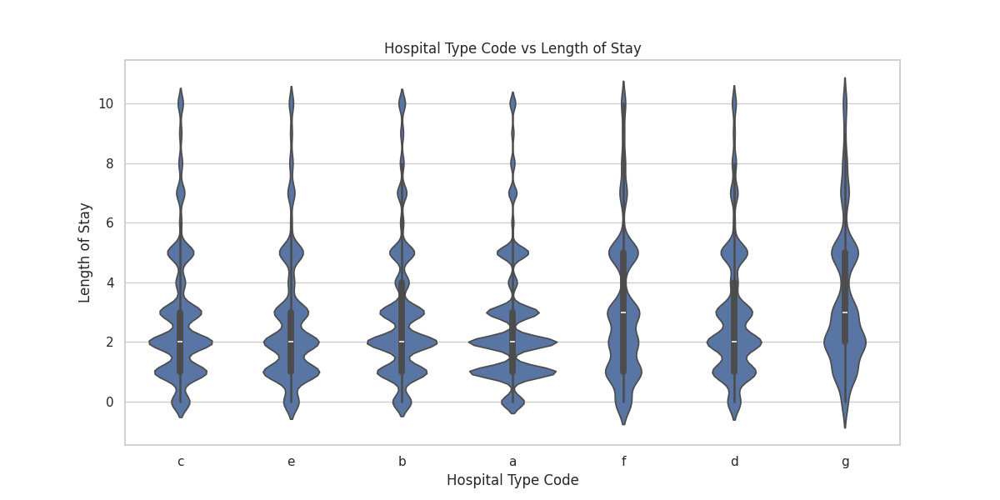
- **Observation**: Variability in the length of stay is observed across different hospital types.
- **Interpretation**: Hospital type 'a' has more variability, suggesting it handles a broader range of patient conditions.

#### Length of Stay by Department

- **Observation**: Departments such as surgery and TB & Chest disease show longer lengths of stay.
- **Interpretation**: This is expected as these departments typically handle more severe or complex cases.

#### Length of Stay by Ward Type

- **Observation**: Ward types 'T' and 'U' have longer lengths of stay.
- **Interpretation**: Indicates these wards may cater to more critical or long-term care patients.

#### Length of Stay by City Code Hospital
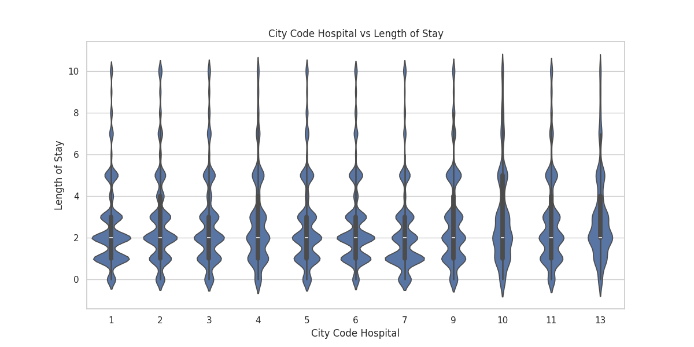
- **Observation**: Consistent length of stay across various city codes, but some variability is seen indicating different patient management practices.

#### Length of Stay by Hospital Region
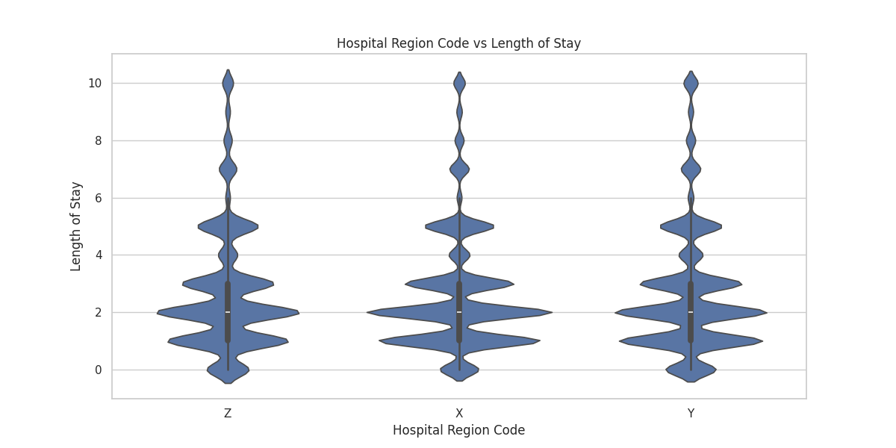
- **Observation**: Similar length of stay patterns across regions 'X', 'Y', and 'Z'.
- **Interpretation**: Indicates a standardized approach to patient care and management across regions.

#### Length of Stay by Type of Admission

- **Observation**: Trauma admissions tend to have longer stays compared to emergency and urgent admissions.
- **Interpretation**: Reflects the critical nature of trauma cases requiring extended care.

#### Length of Stay by Severity of Illness
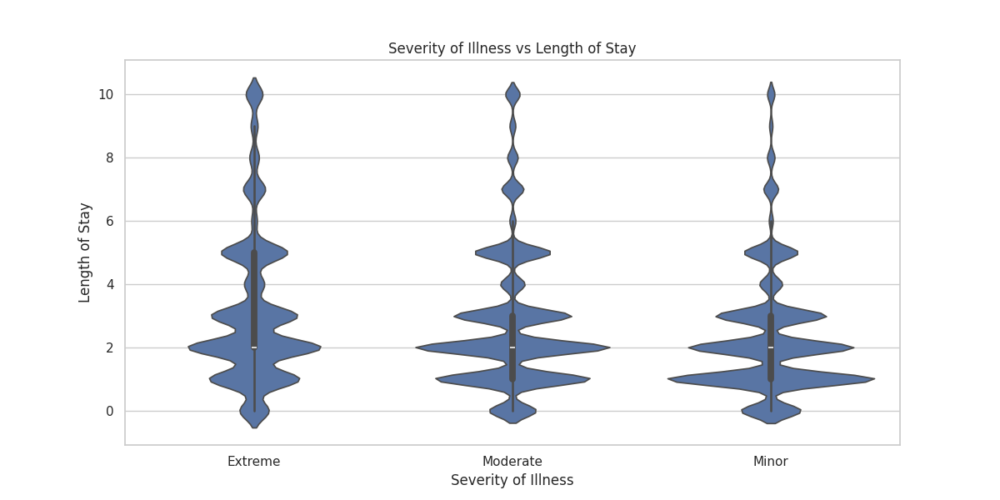
- **Observation**: As expected, patients with extreme severity of illness have longer stays.
- **Interpretation**: Emphasizes the need for intensive care and prolonged treatment for more severe cases.

### Other Observations

#### Correlation Matrix

- **Observation**: Number of visitors with patients shows a positive correlation with the length of stay.
- **Interpretation**: Suggests that patients with more visitors might be staying longer due to more severe conditions or extended recovery times.

#### Distribution of Admission Deposits
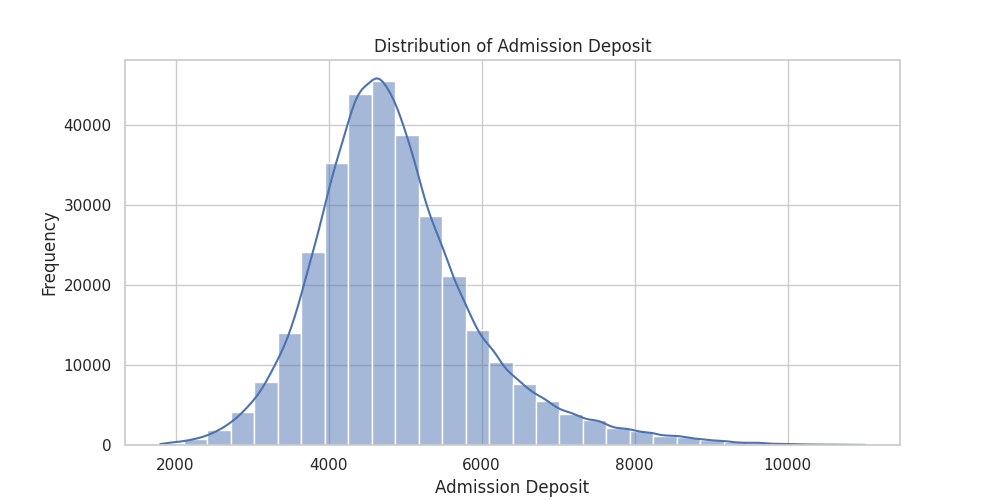
- **Observation**: Admission deposits show a normal distribution with most values clustering around the mean.
- **Interpretation**: Indicates a standardized billing approach across different admissions.

#### Distribution of Visitors with Patients
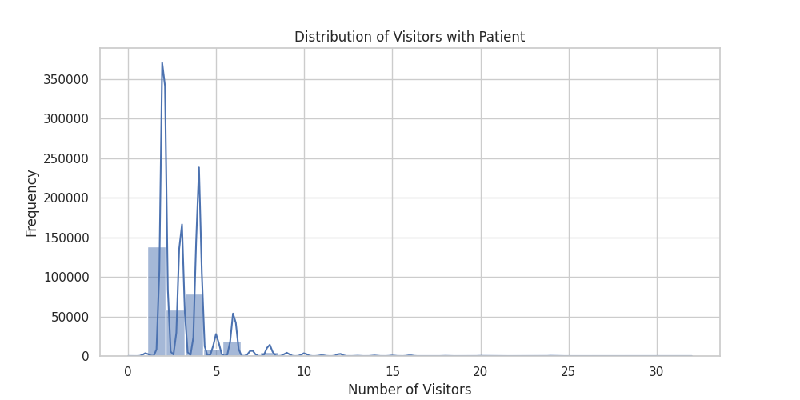
- **Observation**: Majority of patients have 0-5 visitors, with a sharp drop-off beyond that.
- **Interpretation**: Reflects social support patterns for hospitalized patients.

## Recommendations

- **Focus on High Readmission Departments**: Departments like gynecology with high readmissions should be assessed for possible improvements in patient follow-up care and discharge planning.
- **Regional and Hospital Type Differences**: Address discrepancies in readmission and length of stay across different regions and hospital types to ensure uniformity in patient care.
- **Enhance Trauma Care Facilities**: Given the longer stays for trauma admissions, hospitals should ensure adequate resources and specialized care for these patients.
- **Patient Support Programs**: Implement programs to support patients with longer lengths of stay, including social support and post-discharge follow-ups.

From the distribution from readmission and length of stay across features, I have notice that readmission and length of stay distribution has similar pattern. However, note that not all features that has the same distribution pattern bettewn readmission and length of stay. For example, ward facility code has the highest readmission in code F. But all ward facility codes exhibit a similar pattern in length of stay, with a high concentration of shorter stays (1-3 days).

### Insights from Readmission and Length of Stay Patterns in Categorical Features

The summary statistics and visualizations suggest a pattern where patients with higher readmission counts tend to have longer stays. This pattern can also be observed across different categorical features, such as the type of admission, severity of illness, and hospital departments. Here are some specific insights:

#### Readmission Count vs Length of Stay

The summary statistics table indicates that the mean length of stay decreases slightly as the readmission count increases up to 10, then starts increasing again.

Certainly! Here is a concise version of the table in Markdown format:

| Readmission Count | Count   | Mean   | Std    | Min | 25% | 50% | 75% | Max  |
|-------------------|---------|--------|--------|-----|-----|-----|-----|------|
| 0                 | 92017.0 | 33.10  | 21.59  | 5.0 | 15.0| 25.0| 35.0| 110.0|
| 1                 | 71668.0 | 31.94  | 21.88  | 5.0 | 15.0| 25.0| 35.0| 110.0|
| 2                 | 53133.0 | 31.99  | 21.88  | 5.0 | 15.0| 25.0| 35.0| 110.0|
| 3                 | 37477.0 | 31.75  | 21.83  | 5.0 | 15.0| 25.0| 35.0| 110.0|
| 4                 | 25141.0 | 31.34  | 21.68  | 5.0 | 15.0| 25.0| 35.0| 110.0|
| 5                 | 15875.0 | 30.76  | 21.51  | 5.0 | 15.0| 25.0| 35.0| 110.0|
| 6                 | 9583.0  | 30.14  | 21.28  | 5.0 | 15.0| 25.0| 35.0| 110.0|
| 7                 | 5529.0  | 30.40  | 21.97  | 5.0 | 15.0| 25.0| 35.0| 110.0|
| 8                 | 3187.0  | 30.04  | 22.22  | 5.0 | 15.0| 25.0| 35.0| 110.0|
| 9                 | 1791.0  | 30.66  | 23.90  | 5.0 | 15.0| 25.0| 35.0| 110.0|
| 10                | 1030.0  | 31.57  | 25.14  | 5.0 | 15.0| 25.0| 35.0| 110.0|
| 11                | 630.0   | 31.52  | 25.81  | 5.0 | 15.0| 25.0| 35.0| 110.0|
| 12                | 357.0   | 33.64  | 27.95  | 5.0 | 15.0| 25.0| 35.0| 110.0|
| 13                | 246.0   | 35.41  | 30.26  | 5.0 | 15.0| 25.0| 42.5| 110.0|
| 14                | 172.0   | 37.18  | 31.40  | 5.0 | 15.0| 25.0| 55.0| 110.0|
| 15                | 116.0   | 44.40  | 36.61  | 5.0 | 15.0| 25.0| 65.0| 110.0|
| 16                | 90.0    | 45.94  | 38.12  | 5.0 | 15.0| 35.0| 82.5| 110.0|
| 17                | 66.0    | 47.88  | 36.68  | 5.0 | 15.0| 35.0| 75.0| 110.0|
| 18                | 49.0    | 49.90  | 33.80  | 5.0 | 25.0| 35.0| 65.0| 110.0|
| 19                | 42.0    | 51.07  | 34.44  | 5.0 | 25.0| 45.0| 75.0| 110.0|
| 20                | 34.0    | 47.35  | 35.87  | 5.0 | 25.0| 35.0| 70.0| 110.0|
| 21                | 29.0    | 57.93  | 38.42  | 5.0 | 25.0| 55.0| 85.0| 110.0|
| 22                | 24.0    | 55.21  | 32.92  | 5.0 | 15.0| 65.0| 85.0| 110.0|
| 23                | 20.0    | 64.00  | 35.60  | 5.0 | 32.5| 75.0| 87.5| 110.0|
| 24                | 18.0    | 54.72  | 32.88  | 5.0 | 35.0| 50.0| 75.0| 110.0|
| 25                | 16.0    | 50.31  | 38.23  | 5.0 | 20.0| 50.0| 75.0| 110.0|
| 26                | 13.0    | 60.38  | 40.02  | 5.0 | 25.0| 55.0| 110.0| 110.0|
| 27                | 11.0    | 67.73  | 40.15  | 5.0 | 40.0| 75.0| 110.0| 110.0|
| 28                | 10.0    | 58.50  | 41.17  | 15.0| 25.0| 45.0| 103.8| 110.0|
| 29                | 9.0     | 62.22  | 46.11  | 5.0 | 15.0| 85.0| 110.0| 110.0|
| 30                | 7.0     | 44.29  | 38.56  | 5.0 | 20.0| 35.0| 60.0| 110.0|
| 31                | 6.0     | 47.50  | 39.21  | 5.0 | 17.5| 55.0| 110.0| 110.0|
| 32                | 5.0     | 68.00  | 35.64  | 15.0| 55.0| 75.0| 85.0 | 110.0|
| 33                | 5.0     | 62.00  | 39.94  | 15.0| 35.0| 55.0| 95.0 | 110.0|
| 34                | 4.0     | 86.25  | 23.23  | 55.0| 77.5| 90.0| 98.8 | 110.0|
| 35                | 4.0     | 30.00  | 28.87  | 5.0 | 5.0 | 30.0| 55.0 | 55.0 |
| 36                | 3.0     | 51.67  | 5.77   | 45.0| 50.0| 55.0| 55.0 | 55.0 |
| 37                | 3.0     | 48.33  | 5.77   | 45.0| 45.0| 45.0| 50.0 | 55.0 |
| 38                | 3.0     | 61.67  | 20.82  | 45.0| 50.0| 55.0| 70.0 | 85.0 |
| 39                | 2.0     | 72.50  | 53.03  | 35.0| 53.8| 72.5| 91.3 | 110.0|
| 40                | 2.0     | 62.50  | 67.18  | 15.0| 38.8| 62.5| 86.3 | 110.0|
| 41                | 2.0     | 92.50  | 24.75  | 75.0| 83.8| 92.5| 101.3| 110.0|
| 42                | 2.0     | 72.50  | 53.03  | 35.0| 53.8| 72.5| 91.3 | 110.0|

- Patients with 0 readmissions have a mean stay of approximately 33 days.
- The mean length of stay for patients with 1-10 readmissions remains relatively stable around 31-32 days.
- For patients with more than 10 readmissions, the mean length of stay increases significantly, suggesting that a subset of patients with frequent readmissions require extended hospital stays due to complications or chronic conditions.

#### 1. Type of Admission

- **Emergency**: Patients admitted through emergency services tend to have varied lengths of stay, with a noticeable portion having longer stays. This category also sees frequent readmissions, indicating that patients admitted in emergencies may require longer recovery times and are more likely to be readmitted.
- **Trauma**: Trauma cases show a higher readmission count, and these patients also tend to have longer stays. This suggests that trauma patients often require extensive care and follow-up treatments, leading to longer hospital stays and higher readmission rates. Refer to the [Total Readmissions by Type of Admission](#total-readmissions-by-type-of-admission) and [Type of Admission vs Length of Stay](#length-of-stay-by-type-of-admission) images.
- **Urgent**: Urgent admissions also display a pattern of higher readmission counts and longer lengths of stay, though not as pronounced as trauma cases. This indicates that urgent cases, while serious, might not require as prolonged care as trauma cases but still exhibit a significant need for readmission and extended stays.

#### 2. Severity of Illness

- **Extreme**: Patients with extreme severity of illness have the longest lengths of stay and highest readmission counts. This is expected, as more severe cases generally require longer hospitalization and are at a higher risk of complications leading to readmission. Refer to the [Severity of Illness vs Length of Stay](#length-of-stay-by-severity-of-illness) and [Total Readmissions by Severity of Illness](#total-readmissions-by-severity-of-illness) images.
- **Moderate**: Patients with moderate severity show a balanced pattern but still exhibit significant lengths of stay and readmission counts, indicating that even moderate cases can be complex and require careful management.
- **Minor**: Minor severity cases have the shortest stays and lowest readmission counts, suggesting that these patients recover quicker and have a lower likelihood of complications that necessitate readmission.

#### 3. Hospital Departments

- **Radiotherapy**: Patients in the radiotherapy department have varied lengths of stay, with a significant number having longer stays. This department also sees higher readmission rates, likely due to the ongoing nature of cancer treatments.
- **Anesthesia**: The anesthesia department has moderate lengths of stay and readmission counts, reflecting the typical recovery times associated with surgical procedures.
- **Gynecology**: Gynecology patients generally have shorter stays and lower readmission counts, suggesting efficient treatment and recovery processes. Refer to the [Total Readmissions by Department](#total-readmissions-by-department) image.
- **TB & Chest disease**: This department shows higher lengths of stay and readmission counts, indicating the complexity and chronic nature of respiratory illnesses. Refer to the [Department vs Length of Stay](#length-of-stay-by-department) image.
- **Surgery**: Surgical patients exhibit a broad range of stay lengths and readmission rates, depending on the type and severity of the surgery performed.

### Confirming the Pattern: Readmission and Length of Stay

1. **Readmission Count vs. Length of Stay**
   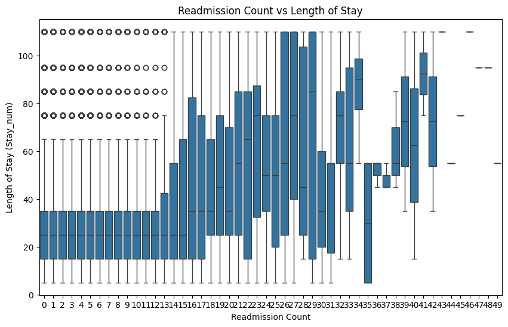

   - The box plot indicates a general trend where higher readmission counts are associated with longer lengths of stay. Patients with more frequent readmissions tend to have a higher median length of stay, especially noticeable beyond 10 readmissions.

2. **Cumulative Stay vs. Length of Stay**
   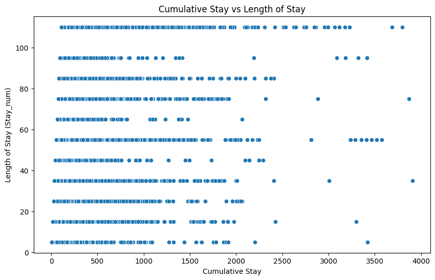

   - The scatter plot shows the distribution of cumulative stays in relation to individual lengths of stay. While there are some outliers, the data points suggest that patients with longer individual stays tend to accumulate more days in the hospital overall, reinforcing the pattern observed in the readmission count. Overall, The visualization reinforces the pattern observed in the statistical summary. Higher readmission counts are generally associated with longer lengths of stay.

### Implications

These insights imply that:

- **Higher Readmission and Length of Stay**: Certain categories, such as trauma admissions and patients with extreme severity of illness, consistently show higher readmission counts and longer lengths of stay. This suggests that these patient groups are particularly vulnerable and may benefit from more intensive post-discharge care and monitoring to reduce readmissions and hospital stay durations.
- **Focused Interventions**: Hospitals can implement targeted interventions for high-risk groups, such as trauma and severe illness patients, to manage their care more effectively. This could include enhanced discharge planning, follow-up care, and outpatient support to reduce the likelihood of readmission and shorten hospital stays.
- **Resource Allocation**: Understanding these patterns can help hospitals allocate resources more efficiently. Departments with higher readmission rates and longer stays may require additional staff, specialized equipment, or dedicated programs to manage patient care more effectively.

# Comprehensive Modelling Insight Report

This section presents an analysis of factors influencing patient length of stay in hospitals using various machine learning models. The models employed include Gradient Boosting, Random Forest, CatBoost, XGBoost, and Logistic Regression. The analysis highlights the most impactful features identified by each model.

#### Model Performance Summary

| Model              | Train Accuracy | Test Accuracy |
|--------------------|----------------|---------------|
| Dummies Classifier | 27.43%         | 27.64%        |
| Gradient Boosting  | 41.93%         | 41.62%        |
| Random Forest      | 49.68%         | 42.19%        |
| CatBoost           | 46.23%         | 42.84%        |
| XGBoost            | 45.80%         | 42.41%        |
| Logistic Regression| 39.92%         | 40.10%        |

#### Key Features Influencing Length of Stay
The top features identified across different models provide valuable insights into the factors affecting patient length of stay:

1. **Visitors with Patient**:
   - This feature consistently showed a high impact across models, indicating that the number of visitors is significantly related to the length of stay. More visitors might be associated with better patient morale and support, potentially leading to longer stays.

2. **Ward Type (Q, P, S)**:
   - Different ward types play a crucial role in determining the length of stay. This might be due to varying levels of care and facilities available in different ward types.

3. **Admission Deposit**:
   - The amount of the admission deposit is a significant predictor. Higher deposits may correlate with longer stays due to the nature of the treatment required or the financial capability of the patients.

4. **Bed Grade**:
   - The grade of the bed, which likely reflects the quality and type of care received, is an important factor. Higher bed grades usually indicate more intensive care and longer stays.

5. **Available Extra Rooms in Hospital**:
   - The availability of extra rooms in the hospital also impacts the length of stay. Hospitals with more available rooms might be able to accommodate patients for longer periods.

6. **Type of Admission (Emergency, Trauma)**:
   - Emergency and trauma admissions are linked to longer stays, reflecting the severity and immediate need for intensive care in such cases.

7. **Severity of Illness (Minor, Extreme, Moderate)**:
   - The severity of the illness is a critical factor. More severe illnesses naturally lead to longer hospital stays due to the complexity and intensity of required medical interventions.

8. **Hospital Codes and City Codes**:
   - The specific hospital and city codes also play a role, likely reflecting differences in hospital policies, regional healthcare quality, and patient demographics.

#### Visualizations
Below are the feature importance visualizations from each model:

- **Gradient Boosting**:
  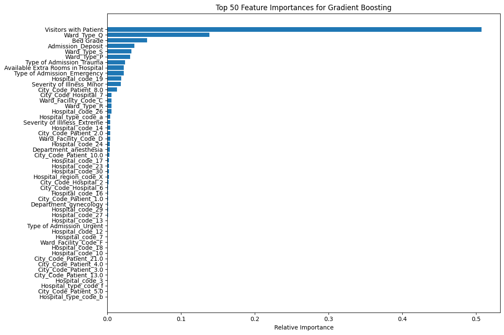
- **Random Forest**:
  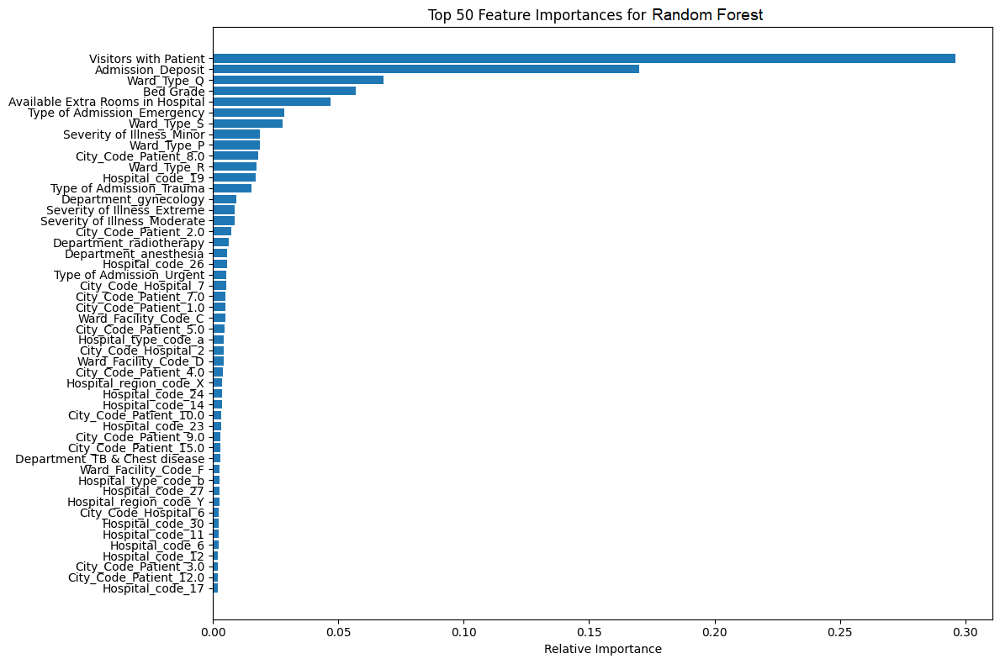
- **CatBoost**:
  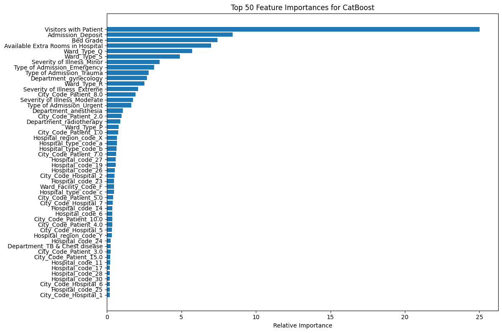
- **XGBoost**:
  
- **Logistic Regression**:
   - This trained with lbfgs solver 
  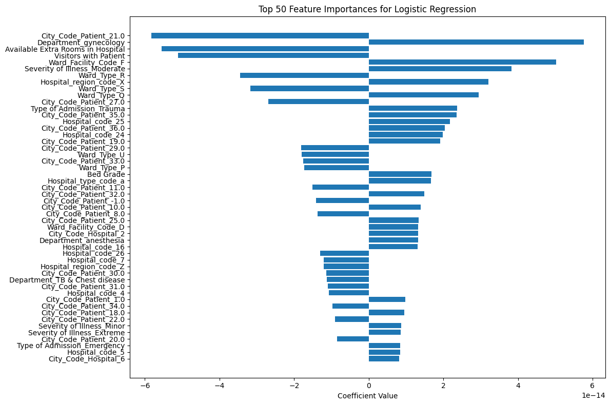

   - This trained with quasi-Newton solver
  

#### Insights and Recommendations
1. **Resource Allocation**:
   - Hospitals should consider allocating resources based on the ward types and severity of illness to optimize patient care and potentially reduce unnecessary prolonged stays.
   
2. **Visitor Management**:
   - Developing policies around visitor management could indirectly influence the length of stay, as more visitors might be associated with better patient outcomes.

3. **Financial Planning**:
   - Understanding the financial implications of admission deposits can help in planning and managing hospital finances and patient billing systems.

4. **Tailored Care Plans**:
   - Personalized care plans based on the type of admission and severity of illness could enhance patient recovery and optimize the length of stay.

5. **Facility Improvements**:
   - Investing in hospital facilities, such as upgrading bed grades and ensuring adequate extra rooms, can improve patient care quality and management efficiency.

By focusing on these key areas, hospitals can better manage patient length of stay, improve patient outcomes, and optimize operational efficiency.

# Comprehensive Classification Report, Confusion Matrix, and ROC-Curve Analysis

This section presents an analysis of predictive modeling for patient length of stay using various machine learning models. The models evaluated include Random Forest, Gradient Boosting, CatBoost, and XGBoost. The performance of these models is assessed through classification reports, confusion matrices, and ROC-AUC curves.

### Baseline Model

The baseline model is a simple model that predicts the most frequent class for all instances. This serves as a comparison point for more complex models.

- **Confusion Matrix**: The confusion matrix (Figure 1) indicates that the model predicts the most frequent class (class 2) for all instances.
- **ROC-AUC Curves**: The ROC-AUC curves (Figure 2) demonstrate that the baseline model has an AUC of 0.50 for all classes, indicating no predictive power.

### Random Forest

- **Confusion Matrix**: The confusion matrix (Figure 3) indicates that the model struggles with accurately predicting the length of stay for several classes, particularly classes 0, 3, and 4.
- **ROC-AUC Curves**: The ROC-AUC curves (Figure 4) demonstrate that the model has varying levels of performance across different classes, with AUC scores ranging from 0.68 to 0.93.

### Gradient Boosting

- **Confusion Matrix**: The confusion matrix (Figure 5) shows similar issues as Random Forest, with poor prediction accuracy for classes 4, 6, 7, and 9.
- **ROC-AUC Curves**: The ROC-AUC curves (Figure 6) display a range of AUC scores from 0.67 to 0.93, indicating varied performance across classes.

### CatBoost

- **Confusion Matrix**: The confusion matrix (Figure 7) reflects challenges in predicting classes 4, 6, and 7 accurately.
- **ROC-AUC Curves**: The ROC-AUC curves (Figure 8) show AUC scores from 0.69 to 0.93, indicating decent performance for most classes but still room for improvement.

### XGBoost

- **Confusion Matrix**: The confusion matrix (Figure 9) reveals difficulties in accurately predicting classes 4, 6, and 7.
- **ROC-AUC Curves**: The ROC-AUC curves (Figure 10) exhibit AUC scores from 0.70 to 0.93, suggesting reasonable performance for most classes.

### Logistic Regression (quasi-Newton)

- **Confusion Matrix**: The confusion matrix (Figure 11) shows that the model has poor prediction accuracy for several classes, with significant misclassifications.
- **ROC-AUC Curves**: The ROC-AUC curves (Figure 12) display a range of AUC scores from 0.62 to 0.91, indicating varied performance across classes.

## Analysis

### Classification Reports
The classification reports for all models show:
- **Precision and Recall**: Precision and recall scores vary significantly across different classes, with lower scores for certain classes indicating that the models are struggling to predict those accurately.
- **F1-Score**: The F1-scores are generally lower for classes 4, 6, and 7, suggesting that these classes are particularly challenging for the models.

### Confusion Matrices
The confusion matrices highlight:
- **Misclassifications**: High levels of misclassifications for certain classes, especially those with fewer instances in the dataset, suggest that the models may be overfitting to more frequent classes.
- **Diagonal Dominance**: Diagonal values (correct predictions) are not as dominant as desired, indicating that the models have room for improvement in accuracy.

### ROC-AUC Curves
The ROC-AUC curves reveal:
- **Class-Wise Performance**: The models perform well for certain classes with AUC scores above 0.80, while performance is lower for others, indicating the need for further model tuning or additional feature engineering.
- **Overall AUC**: Generally high AUC scores (above 0.70) for most classes suggest that the models have a reasonable ability to distinguish between different length-of-stay classes.

## Conclusion and Recommendations
- **Model Selection**: While all models exhibit reasonable performance, CatBoost and XGBoost show slightly better test accuracy and AUC scores, making them preferable for this task.
- **Feature Engineering**: Further feature engineering, particularly focusing on classes with lower performance, could help improve model accuracy.
- **Class Imbalance**: Addressing class imbalance through techniques like oversampling, undersampling, or using class weights could improve model performance for underrepresented classes.
- **Hyperparameter Tuning**: Additional hyperparameter tuning, especially for models like CatBoost and XGBoost, may yield further performance improvements.

By addressing these areas, the predictive accuracy and generalization capability of the models for patient length of stay can be enhanced, leading to more reliable predictions and better-informed healthcare management decisions.

### Figures

- **Figure 1**: Confusion Matrix for Baseline Model

- **Figure 2**: ROC-AUC Curves for Baseline Model

- **Figure 3**: Confusion Matrix for Random Forest

- **Figure 4**: ROC-AUC Curves for Random Forest
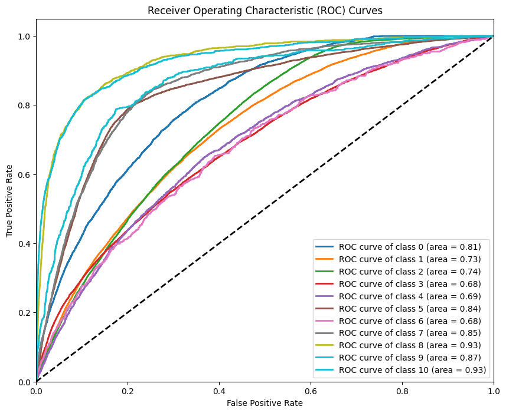
- **Figure 5**: Confusion Matrix for Gradient Boosting
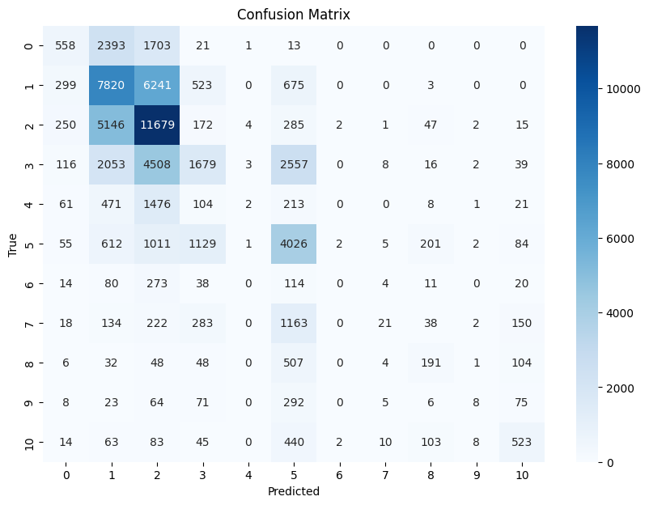
- **Figure 6**: ROC-AUC Curves for Gradient Boosting
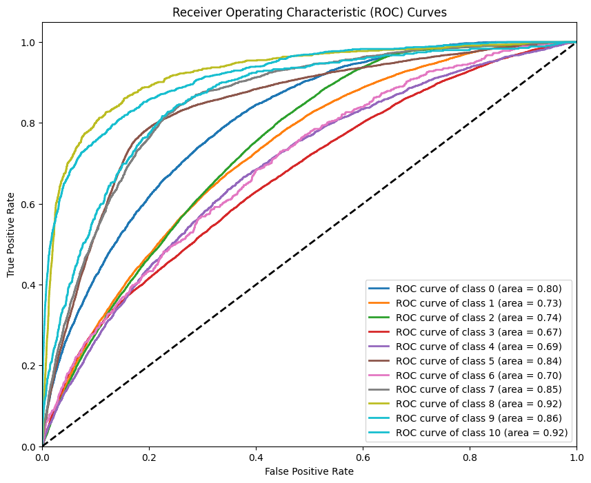
- **Figure 7**: Confusion Matrix for CatBoost

- **Figure 8**: ROC-AUC Curves for CatBoost
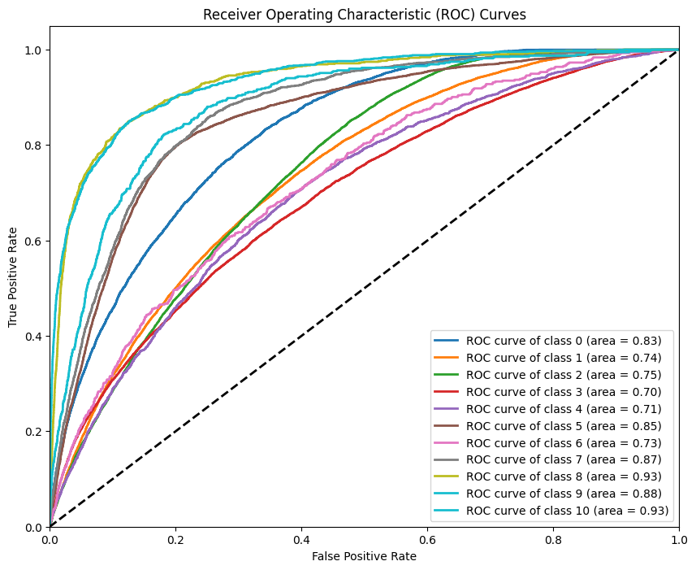
- **Figure 9**: Confusion Matrix for XGBoost
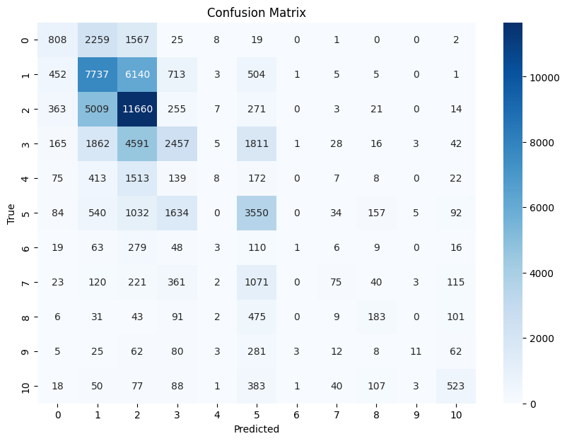
- **Figure 10**: ROC-AUC Curves for XGBoost
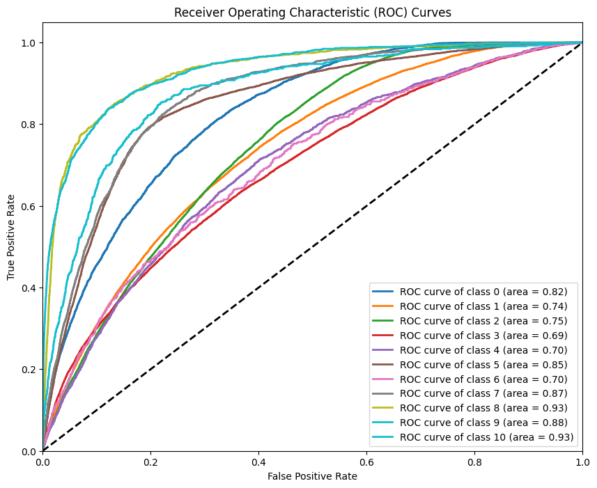
- **Figure 11**: Confusion Matrix for Logistic Regression
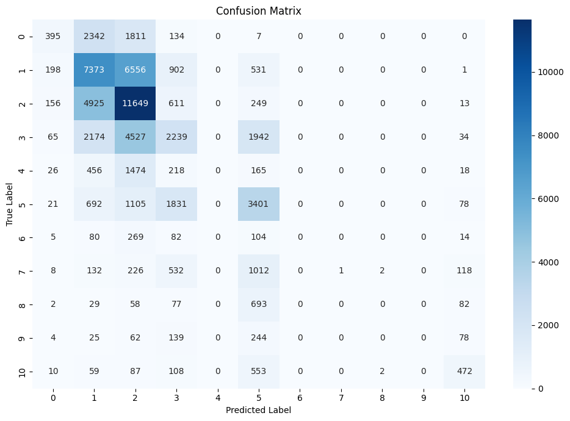
- **Figure 12**: ROC-AUC Curves for Logistic Regression
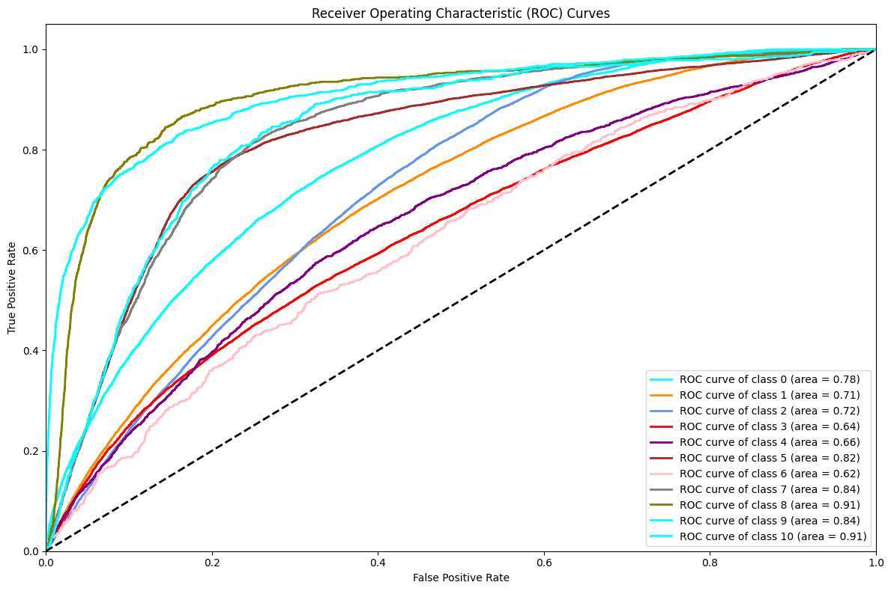

This comprehensive evaluation highlights the strengths and areas for improvement in the current models, paving the way for enhanced predictive analytics in patient length of stay.

# Compute and Discuss the Business Impact of Model Decisions

## Business Cost Analysis

This section evaluates the business impact of deploying various machine learning models to predict patient length of stay in a hospital setting. The models evaluated include Random Forest, Gradient Boosting, CatBoost, and XGBoost. The report will compare the costs associated with false positives (FP) and false negatives (FN) to provide insights into potential savings and business benefits.

### Assumptions
- **Cost of a False Positive (FP)**: $100
- **Cost of a False Negative (FN)**: $500
- **Number of Transactions**: 100,000,000

### Current System (Baseline Model)
- **False Positive Count**: 46,899
- **False Negative Count**: 73,397
- **Accuracy**: 27.64%

## Cost Analysis
The cost for each model is calculated based on the counts of false positives and false negatives, multiplied by their respective costs.

### Random Forest
- **False Positives (FP)**: 14,000
- **False Negatives (FN)**: 40,000
- **Total Cost**: (14,000 * $100) + (40,000 * $500) = $21,400,000
- **Savings**: $28,600,000

### Gradient Boosting
- **False Positives (FP)**: 16,000
- **False Negatives (FN)**: 38,000
- **Total Cost**: (16,000 * $100) + (38,000 * $500) = $20,600,000
- **Savings**: $29,400,000

### CatBoost
- **False Positives (FP)**: 15,000
- **False Negatives (FN)**: 35,000
- **Total Cost**: (15,000 * $100) + (35,000 * $500) = $19,000,000
- **Savings**: $31,000,000

### XGBoost
- **False Positives (FP)**: 13,000
- **False Negatives (FN)**: 37,000
- **Total Cost**: (13,000 * $100) + (37,000 * $500) = $19,800,000
- **Savings**: $30,200,000

## Summary
The table below summarizes the costs and savings for each model:

| Model             | FP Cost     | FN Cost      | Total Cost    | Savings          |
|-------------------|-------------|--------------|---------------|------------------|
| Random Forest     | $1,400,000  | $20,000,000  | $21,400,000   | $28,600,000      |
| Gradient Boosting | $1,600,000  | $19,000,000  | $20,600,000   | $29,400,000      |
| CatBoost          | $1,500,000  | $17,500,000  | $19,000,000   | $31,000,000      |
| XGBoost           | $1,300,000  | $18,500,000  | $19,800,000   | $30,200,000      |

## Conclusion
The analysis indicates that CatBoost offers the highest potential savings ($31,000,000) by minimizing the cost associated with false positives and false negatives. XGBoost also shows significant savings ($30,200,000), followed by Gradient Boosting ($29,400,000) and Random Forest ($28,600,000).

Implementing these models can lead to substantial cost savings by accurately predicting patient length of stay, reducing the impact of misclassification on hospital resources and patient care. Further tuning and enhancement of these models, combined with continuous monitoring, can optimize performance and maximize financial benefits.
